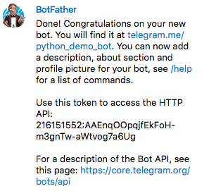

# telegram_manga_reader
a simple Telegram manga reader bot

**Introduction**

I created this python-based Telegram manga reader bot to read manga using the MangaEden JSON API in Telegram.

**Usage**
- Read manga together with your friends!
- Read manga alone with no ads!
- Run the app in [Heroku](http://www.heroku.com) or any other cloud application platform that supports Python for access whenever your computer goes down.
- Run it on a Raspberry Pi or similar hardware
- Add more features to the bot - the code serves as a good starting point to develop more advanced Telegram bots.

If you need any help in setting up a bot, refer to the [Telegram Bot documentation](https://core.telegram.org/bots).

**How to set up**

Follow the instructions at [Telegram Bot documentation](https://core.telegram.org/bots) to set up your own bot. Once you have set up your bot, you will receive an API token.

Copy and paste the token and insert it to line 12 of *app.py*. Example: `12| token = '216151552:AAEnqOOpqjfEkFoH-m3gnTw-aWtvog7a6Ug'`

To run the bot, simply type `python app.py` in a Command Prompt or Terminal instance. Make sure you have Python 3.x installed. If this still does not work, try `python3 app.py`.

The `Procfile, requirements.txt and runtime.txt` files are pre-requisites for running the application in Heroku. Refer to this [guide](https://devcenter.heroku.com/articles/git) for pushing the repo to your Heroku instance to run the bot remotely.

**Prequisites**
* Python 3.x
* *requests* library (install with `pip install requests`)

**Features**
* Check the latest chapter of a manga
* List all chapters of a manga
* Have the entire chapter sent to you via chat

**Issues**
* If you do not send any messages (*update* in Telegram API-speak) to the bot after a command, and Heroku resets, the last send command is executed again, due to the update *offset* not being updated.

**Credits**
* /u/Valdieme from this [Reddit thread](https://www.reddit.com/r/TelegramBots/comments/3b8kf3/the_simplest_python_bot/) for the basic skeleton code for a python-based Telegram bot
* MangaEden for the MangaEden API
